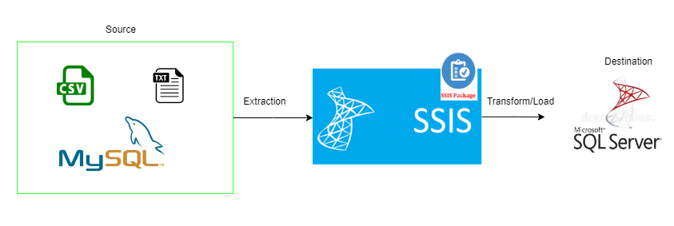
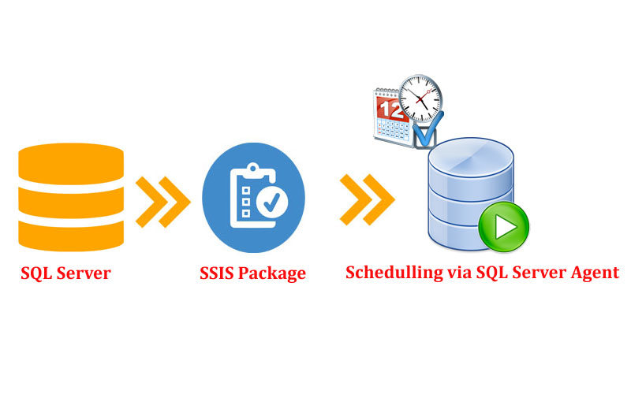

# SSIS ELT Pipeline

## What is it?
This repository contains an ELT (Extract, Load, and Transform) project developed using SQL Server Integration Services (SSIS). It builds a data pipeline to process product and sales data by extracting it from flat files (text and CSV) and MySQL databases, performing necessary transformations, and loading the data into SQL Server databas. 

The project includes:
- Multiple SSIS packages, organized for learning and practical purposes.
- Three main packages focused on extracting and loading product and sales data and constructing a semantic data mart layer.
- A master package that orchestrates the execution of other packages using the SSIS `Execute Package Task`.
- Deployment managed through the SSIS catalog and scheduled using SQL Server Agent.

## Table of Contents
[Features](#features)\
[Architecture Diagram](#architecture-diagram)\
[Technologies Used](#technologies-used)\
[Dependencies (Getting Started)](#dependencies-getting-started)\
[System Requirements](#system-requirements)\
[Configuration](#configuration)\
[Setting Up the Environment](#setting-up-the-environment)\
[Error Handling and Logging](#error-handling-and-logging)\
[Enhancement](#enhancement)

---

## Features
  - Extracts data from flat files (text and CSV formats) and a MySQL database.
  - Transformations performed within SSIS packages.
  - Includes SQL Server stored procedures for advanced transformations and semantic layer creation.
  - Each module (or package) focuses on a distinct phase of the pipeline (extraction, loading, or transformation).
  - A master package orchestrates all workflows efficiently.
  - Event handlers in SSIS capture errors and log them into a dedicated SQL Server table.

---

## Architecture Diagram
Data extracted from **flat files** and **MySQL database**.Transformations applied through **SSIS packages** and **SQL Server stored procedures**. The destination is SQL Server.

For Deployment .ispac file is built from Visual Studio and deployed into the SQL server catalog, for scheduling SQL Server angent is used.

---

## Technologies Used
- **SQL Server Integration Services (SSIS)**
- **Microsoft Visual Studio**
- **SQL Server (Database and Agent)**
- **MySQL**
- **Flat Files (Text & CSV)**

---

## Dependencies (Getting Started)
- **SQL Server** (Standard or higher, includes SSIS):
   - [Download SQL Server](https://www.microsoft.com/en-us/sql-server/)
- **Microsoft Visual Studio** (with SSIS add-on):
   - [Download Visual Studio](https://visualstudio.microsoft.com/)
- **MySQL Database** (can use local or hosted version):
   - [Download MySQL Community Server](https://dev.mysql.com/downloads/)
- **Flat File Data Sources**:
   - Ensure test files (text and CSV) are structured correctly before running the pipeline.
- Additional Notes:
  - Ensure SQL Server Agent is enabled for scheduling SSIS jobs.
  - Have the necessary permissions to create and manage SSIS catalogs.

---

## Configuration
### Setting Up the Environment
1. **SSIS Development**:
   - Open SSIS solution in Microsoft Visual Studio.
   - Review package parameters and update file paths or database connections if needed.

2. **Database Setup**:
   - Run the provided SQL scripts to:
     - Create destination tables for product and sales data.
     - Set up stored procedures for semantic layer transformations.

3. **Deployment**:
   - Generate deployment files through Visual Studio.
   - Upload to the SSIS catalog in SQL Server.

4. **Scheduling**:
   - Use SQL Server Agent to schedule the execution of the master package.

---

## Error Handling and Logging
- **Event Handlers in SSIS**:
  - Configured to log errors and execution details at the package level.
  - Logs stored in a dedicated SQL Server table.
- **Troubleshooting**:
  - In case of a failed package, refer to the log table for detailed error information.

---

## Enhancement
Planned updates for the project include:
1. Email notifications for batch statuses and monitoring results.
2. Enhanced logging features to include performance metrics.
3. Addition of error alerts integrated with monitoring tools.